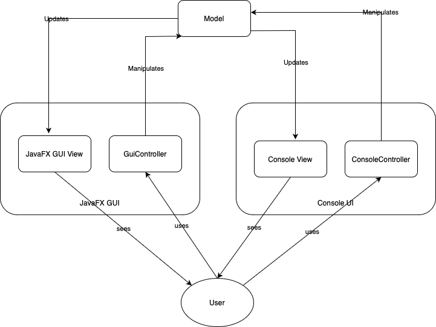

# Отчёт по лабораторной работе №1
## UML-диаграмма последовательности взаимодействия частей приложения

## UI
Реализовано два варината `UI`
 - графический
   - с использованием `JavaFX`;
   - сценарии добавления/удаления книг и жураналов;
   - запуск `./gradlew run --args='gui'`;
 - консольный
   - сценарий добавления книг и журанлов;
   - запуск `./gradlew run --args='cli'`.

## Компоненты

 - `JavaFX view` `library.view.library-view.fxml`
   - представление для `GUI`;
 - `library.controller.GuiController`
   - `GUI` контроллер;
 - `library.model`
   - пакет модели;
   - ключевые сущности: `Library`, `Publication`, `Book`, `Magazine`;
 - `App`
   - главный класс, главным образом, необходим для выбора `UI` режима:
     - `library.application.ConsoleApp` и `library.application.GuiLauncher`
       - связки контроллеров и представлений для соответсвующего `UI` режима.