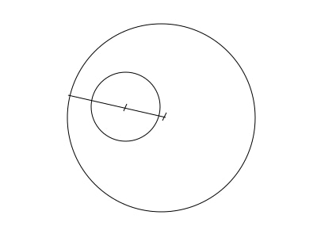
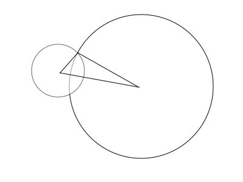
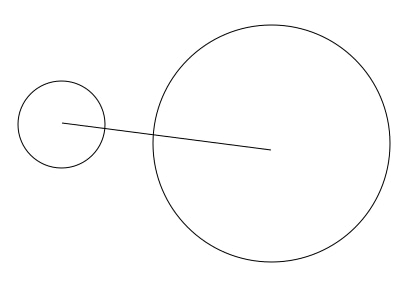

# Отчёт по лабораторной работе №3

## Задача №2
Сумма цифр трёхзначного числа и их обратная перестановка.

Цифры числа получаются через использованием операций `//` (`div`) и `%` (`mod`) по основанию $10^n, n \in [1;2]\cap\N$. После остаётся тривиальная задача вычисления суммы и перестановки.

## Задача №3

Определение времени в формате `h:m:s` по положению стрелки в градусах.

Для решения задачи необходимо научиться определять доли соответсвующие часу, минуте и секунде в полном круге. Для этого достаточно посчитать следующие очевидные формулы.

 - час: `360 / 12`
   - `12` часов на циферблате;
 - минута: `(360 / 12) / 60`
   - `60` минут в часе;
 - секунда: `((360 / 12) / 60) / 60`
   - `60` секунд в минуте.

Далее задача сводится к использованию деления на вычисленные доли, округления и вычитания посчитанных результатов.

## Задача №6
Определить пересекаются ли окружности по заданным координатам центров и радиусам.

Разобьём задачу на три части относительно положений окружностей:

 1. Одна окружность полностью перекрывают другую;

 

 2. Окружности пересекаются;

 

 3. Окружности не пересекаются и не наклыдваются.

 
 

Все три случая описываются через вычисление растояния между центрами окружностей и сравнением его с радиусами окружностей, для удобство будем считать, что первая окружность имеет не меньший радиус:
 1. $\sqrt{(x_1 - x_2)^2 + (y_1 - y_2)^2} \le r_1$;
 2. $\sqrt{(x_1 - x_2)^2 + (y_1 - y_2)^2} \le r_1 + r_2$;
 3. все остальные случаи.

## Задача №9

Определить является ли данная последовательность неубывающей.

Задача сводится к проверки инварианта $ \forall i \in [0; n-1]\cap \N, x_i \le x_{i + 1} $. Для этого пробежимся по последовательности и проверим противоположное условие, если оно не выполнено последовательность является неубывающей.

## Задача №14

Поиск простых делителей для каждого числа из последовательности.

Для нахождения простых делителей числа воспользуемся простым алгоритмом:
 - Проверяем все числа от 2х до половины изначального числа:
   - Если остаток (результат операции `mod`) равен 0, добавим число в простые делители, и будем делить текущее число на найденный делитель пока результат операции `mod` не изменится.
 - Если текущее число не равно 1, значит остался простой делитель (например изначальное число простое), добавим его к результату.

Проделаем этот алгоритм для каждого числа из последовательности.

## Задача №15

Найти максимального значения, минимального значения, размаха, среднего, медианы и моды данной последовательности с использованием библиотечных функций.

 - максимальное значение: `max(xs)`;
 - максимальное значение: `min(xs)`;
 - максимальное значение: `max(xs) - min(xs)`;
 - среднее: `statistics.mean(xs)`;
 - медиана: `statistics.median(xs)`;
 - мода: `statistics.mode(xs)`.

Сохранение в файл и выгрузка из файл производятся через обёртку с использованием стандартной функции `open`:
```py
with open(filename, mode) as f:
    ...
```

## Задача №16

Вычилить среднее значение, дисперсию, стандартное отклонение данного набора чисел. Визуализировать на графике.

 - среднее значение: `statistics.mean(xs)`
 - дисперсия: `statistics.pvariance(xs)`
 - стандартное отклонение: `statistics.pstdev(xs)`

Отрисовка графика происходит с помощью библиотеки `matplotlib`. На графике показывается через обёртку в последовательноти и их отрисовку:
Пример для среднего значения:
```py
plt.scatter([mean], [0], label='mean', marker='o')
```

## Задача №17

Даны две функции: $y_1 = x^2 + x^4 - x + 5$ и $y_2 = -x^2 + 2x + 15$. Визуально масштабируя график найти точки пересечения.

Стоит отметить, что одна из функций является выпуклой, а другая вогнутой. Это и их расположение позволяет понять, что графики функций пересекаются в `2`, `1` или `0` точках. Таким образом, остаётся играться с границами отрисовки.

### Тонкости реализации
На самом деле, функции заменяются их апроксимацией в точках, из-за средств `matplotlib`. Таким образом на графике мы отрисовываем отображение одной последовательности в другую.
